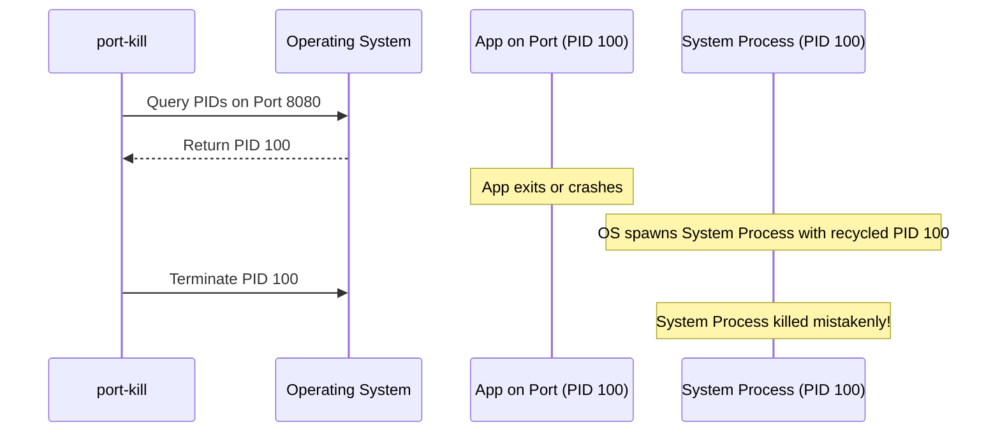

# Security Review Report: `@gks101/port-kill` (Phase 2 Deep Dive)

**Date:** May 30, 2026  
**Auditor:** Expert Security Engineer  
**Scope:** Advanced Threat Modeling & Operational Security of `port-kill-pkg` (Post-Remediation)  
**Overall Security Rating:** **9.5 / 10** (Excellent Posture)

---

## Overall Codebase Rating & Justification

Following the Phase 1 remediations, the `@gks101/port-kill` package has achieved an outstanding security posture.

### Why a 9.5 / 10?

- **Zero Production Dependencies (10/10)**: Prevents supply chain attacks, prototype pollution, and transitive vulnerability risks.
- **Structured Execution (10/10)**: Eliminating string commands and using structured array execution avoids command injection.
- **Fail-Safe Validation (10/10)**: Moves validation checks to the core library API boundary (`killSinglePort`) for defense-in-depth.
- **Operational Side Effects (-0.5)**: Inherent OS-level limitations such as PID recycling race conditions (TOCTOU) and dependency on path-resolved binaries remain, which are typical for node-based system wrappers but must be documented.

---

## Phase 2 Threat Modeling & Security Findings

While the codebase is now secure from direct injection attacks, this phase focuses on lower-likelihood operational risks, design decisions, and system-level interactions.

### SEC-2-01: Time-of-Check to Time-of-Use (TOCTOU) PID Recycling Race (Severity: Low/Medium)

#### Threat Description

The process of terminating a port-bound application occurs in two discrete steps:

1. Querying active PIDs listening on the port (`lsof`, `fuser`, or `netstat`).
2. Terminating the discovered PIDs (`kill` or `taskkill`).

A race condition exists between these steps. In highly active systems, the process occupying the target port might exit immediately after the query. If the OS recycles PIDs rapidly, another unrelated process (potentially a critical system service) could spawn and inherit that PID before the termination signal is sent.



#### Recommendation

While preventing PID recycling is an OS-level challenge, the library can mitigate this by minimizing the latency window.

- Avoid any heavy computations or asynchronous delays between `findPids` and `terminatePids`.
- Document this risk so users are aware when orchestrating highly volatile microservices.

---

### SEC-2-02: Executable Resolution via PATH Hijacking (Severity: Medium)

#### Threat Description

The library relies on system executables (`lsof`, `fuser`, `netstat`, `kill`, `taskkill`) resolved via the system's `PATH` environment variable:

```typescript
export const COMMAND_BINARIES = {
  LSOF: 'lsof',
  FUSER: 'fuser',
  NETSTAT: 'netstat',
  KILL: 'kill',
  TASKKILL: 'taskkill',
} as const;
```

If a malicious actor gains local access to the system and is able to manipulate the `PATH` environment variable (e.g. prepending a writable temp directory), they could write a malicious binary named `lsof` or `taskkill` which `port-kill` would then execute with the privilege level of the running Node.js process.

> [!CAUTION]
> If `port-kill` is run with elevated privileges (e.g., via `sudo` or as Administrator), PATH hijacking could result in local privilege escalation.

#### Recommendation

Validate or restrict the paths from which binaries are resolved, or fall back to absolute path lookups (e.g. `/usr/bin/lsof`) if they exist.
For node-level defense, sanity check that the paths resolved from `PATH` do not reside in insecure writable directories (like `/tmp` or `C:\Users\...\AppData\Local\Temp`).

---

### SEC-2-03: Resource Exhaustion via Large CLI Output (Severity: Low)

#### Threat Description

`spawnSync` buffers the complete output of the spawned process (`stdout` and `stderr`) in-memory. In enterprise scale environments or on servers with high-density socket allocations (e.g., reverse proxies with tens of thousands of open connections), tools like `netstat -ano` or `lsof` can return multi-megabyte payloads.

Reading, stringifying, and splitting large buffers synchronously can cause severe CPU spikes or trigger Out-Of-Memory (OOM) crashes in memory-constrained runtimes (like AWS Lambda or small Docker containers).

#### Recommendation

Implement a length/size limit constraint on the returned buffer, or switch to line-by-line buffer parsing instead of loading the entire string into memory via `.split('\n')`.

---

### SEC-2-04: Graceful Signal Termination Default (Severity: Informational)

#### Threat Description

By default, the library forces immediate termination (`SIGKILL` on Unix / `/F` on Windows) if `options.force` is not explicitly set to `false`.
While this ensures high success rates for developers freeing up local ports, it poses reliability risks in production environments:

- Processes cannot execute cleanup routines, flush logs, or close database connections cleanly.
- This can lead to file lock corruption, database orphaned connections, and inconsistent state.

> [!TIP]
> Consider changing the default configuration for programmatic users to default to graceful termination (`SIGTERM` / no `/F` flag) with a timeout-fallback to force-kill, while keeping the aggressive default for CLI interactions.

---

### SEC-2-05: EDR / Security Tooling Alerts (Severity: Informational)

#### Threat Description

Many modern Endpoint Detection and Response (EDR) agents and intrusion detection systems flag frequent invocations of network state queries (`netstat -ano`, `lsof`) immediately followed by process termination signals (`taskkill`, `kill -9`) as suspicious behavior resembling lateral movement or port scanning scripts.

#### Recommendation

Make sure this behavior is documented for operations teams so they can configure appropriate allowlists/exclusion rules for CI/CD runtimes or deployment servers running `port-kill`.

---

## Project Lead Feedback (Scope-Aligned Decision)

**Date:** May 30, 2026  
**Reviewer:** Project Lead, `@gks101/port-kill`

### Scope Clarification

This package is designed primarily for **Node.js developer workflows** and **frontend development/runtime environments** (local dev servers, tests, CI setup hooks). It is **not positioned as a standalone host administration/security utility** or production process supervisor.

### Finding-by-Finding Disposition

| Finding ID                                      | Lead Decision                           | Priority      | Rationale                                                                                                                                                                                                                                    |
| :---------------------------------------------- | :-------------------------------------- | :------------ | :------------------------------------------------------------------------------------------------------------------------------------------------------------------------------------------------------------------------------------------- |
| **SEC-2-01 (TOCTOU PID recycling)**             | **Accepted risk, document clearly**     | Medium        | True OS-level race. For our intended short-lived dev/test use, impact is limited; full prevention is not realistic without significantly changing architecture.                                                                              |
| **SEC-2-02 (PATH hijacking)**                   | **Partially accepted, harden docs now** | Medium        | Valid threat if host is already locally compromised or running with elevated privileges. In our developer-focused scope, we should document trusted environments and avoid `sudo` usage guidance before introducing path pinning complexity. |
| **SEC-2-03 (large output resource exhaustion)** | **Accepted for now, monitor**           | Low           | Typical local dev/frontend scenarios do not hit extreme socket cardinality. We should keep implementation simple and only add streaming/size caps if real-world reports appear.                                                              |
| **SEC-2-04 (force-kill default)**               | **Keep current behavior**               | Informational | Current default aligns with primary goal: quickly free blocked dev ports. We will keep `force: true` default and continue exposing `--no-force` / `signal` options for controlled behavior.                                                  |
| **SEC-2-05 (EDR alerts)**                       | **Document behavior**                   | Informational | Reasonable documentation action for CI/enterprise users; no code change required.                                                                                                                                                            |

### Action Plan (Phase 2 Follow-up)

1. Update docs to explicitly state intended usage: Node.js/frontend development and test/CI workflows, not production process orchestration.
2. Add a security notes subsection covering:
   - TOCTOU/PID recycling limitation.
   - PATH trust assumptions and no-elevation recommendation.
   - EDR/allowlist note for enterprise CI runners.
3. Keep runtime behavior unchanged for now to preserve DX and zero-dependency simplicity.

### Final Position

Phase 2 findings are valid and useful. Given this project’s explicit developer-centric scope, we should prioritize **documentation hardening and expectation setting** over invasive runtime complexity that would reduce usability for the primary audience.
